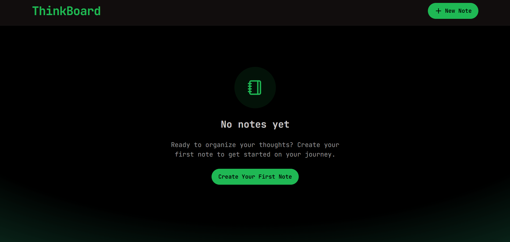
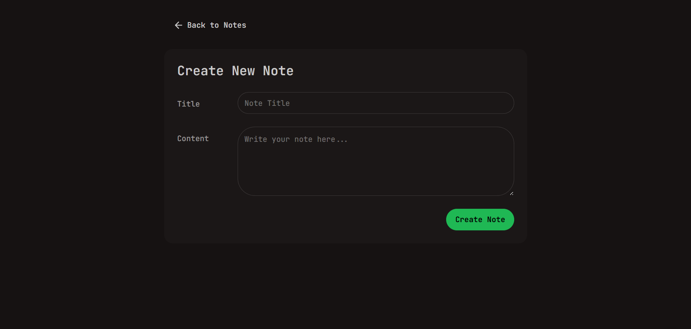
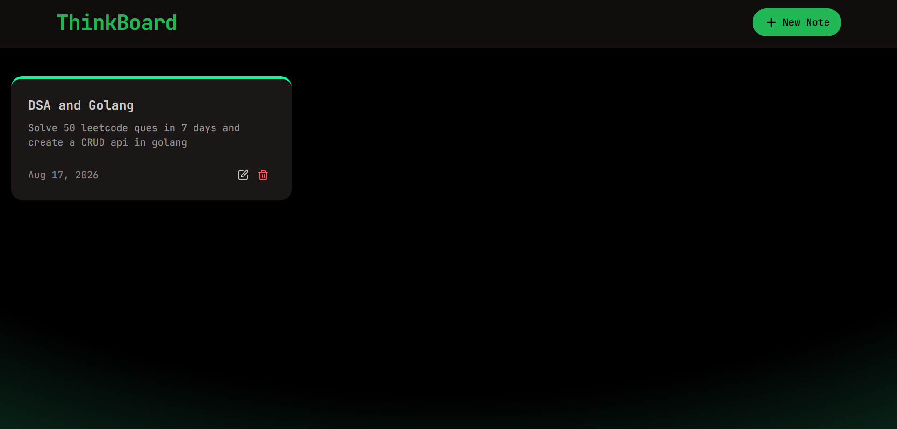

# ThinkBoard

A full-stack note-taking app built with the MERN stack. Create, read, update, and delete notes with rate limiting powered by Upstash Redis.

## Screenshots

### Home Page - Empty State
The clean and welcoming home page when you first start using ThinkBoard.



### Create New Note
An intuitive form to create and organize your thoughts with a title and content area.



### Home Page - With Notes
View all your notes in a beautiful grid layout with quick access to edit and delete.



## Tech Stack

**Backend:**
- Node.js / Express
- MongoDB / Mongoose
- Upstash Redis (rate limiting)

**Frontend:**
- React (Vite)
- Tailwind CSS + DaisyUI
- Axios
- React Router
- React Hot Toast
- Lucide Icons
- JetBrains Mono font

## Project Structure

```
ThinkBoard/
├── backend/
│   ├── src/
│   │   ├── config/
│   │   │   ├── db.js          # MongoDB connection
│   │   │   └── upstash.js     # Upstash rate limiter config
│   │   ├── controllers/
│   │   │   └── notes.controller.js
│   │   ├── middlewares/
│   │   │   └── rateLimiter.js
│   │   ├── models/
│   │   │   └── notes.model.js
│   │   └── routes/
│   │       └── notes.routes.js
│   ├── server.js
│   └── package.json
└── frontend/
    ├── src/
    │   ├── components/
    │   │   ├── Navbar.jsx
    │   │   ├── NoteCard.jsx
    │   │   ├── NotesNoteFound.jsx
    │   │   └── RateLimitedUi.jsx
    │   ├── lib/
    │   │   ├── axios.js       # Axios instance with base URL
    │   │   └── utils.js       # formatDate helper
    │   ├── pages/
    │   │   ├── HomePage.jsx
    │   │   ├── CreatePage.jsx
    │   │   └── NoteDetailPage.jsx
    │   ├── App.jsx
    │   ├── main.jsx
    │   └── index.css
    └── package.json
```

## Getting Started

### Prerequisites

- Node.js 18+
- MongoDB (local or Atlas)
- Upstash Redis account

### Backend Setup

1. Navigate to the backend directory:
   ```bash
   cd backend
   ```

2. Install dependencies:
   ```bash
   npm install
   ```

3. Create a `.env` file:
   ```env
   PORT=3000
   MONGO_URI=your_mongodb_connection_string
   UPSTASH_REDIS_REST_URL=your_upstash_redis_rest_url
   UPSTASH_REDIS_REST_TOKEN=your_upstash_redis_rest_token
   ```

4. Start the server:
   ```bash
   npm run dev
   ```

### Frontend Setup

1. Navigate to the frontend directory:
   ```bash
   cd frontend
   ```

2. Install dependencies:
   ```bash
   npm install
   ```

3. Start the dev server:
   ```bash
   npm run dev
   ```

The app will be available at `http://localhost:5173`.

## API Endpoints

| Method | Endpoint          | Description           |
| ------ | ----------------- | --------------------- |
| GET    | /api/notes        | Get all notes         |
| GET    | /api/notes/:id    | Get a single note     |
| POST   | /api/notes        | Create a new note     |
| PUT    | /api/notes/:id    | Update a note         |
| DELETE | /api/notes/:id    | Delete a note         |

## Rate Limiting

The API uses Upstash Redis to limit requests to **10 requests per 20 seconds**. When exceeded, a 429 response is returned with a visual warning in the UI.

## Features

- CRUD operations for notes
- Responsive grid layout for note cards
- Rate limiting with UI feedback
- Toast notifications for user actions
- Form validation
- JetBrains Mono font throughout
- Dark theme (DaisyUI Forest)

## Usage

1. **Create a Note**: Click the "New Note" button and fill in the title and content
2. **View Notes**: All your notes are displayed as cards on the home page
3. **Edit a Note**: Click the edit icon on any note card to update it
4. **Delete a Note**: Click the trash icon to remove a note
5. **View Note Details**: Click on a note card to see the full note

## Troubleshooting

- **Rate Limited**: If you see a rate limit message, wait 20 seconds before making new requests
- **Connection Error**: Ensure your MongoDB and Upstash Redis credentials are correct in the `.env` file
- **Port Already in Use**: Change the `PORT` variable in your `.env` file if port 3000 is occupied
